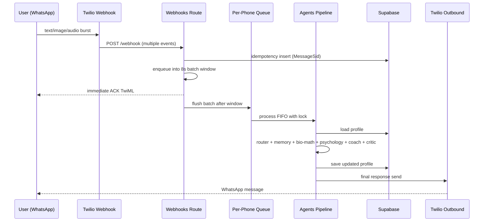
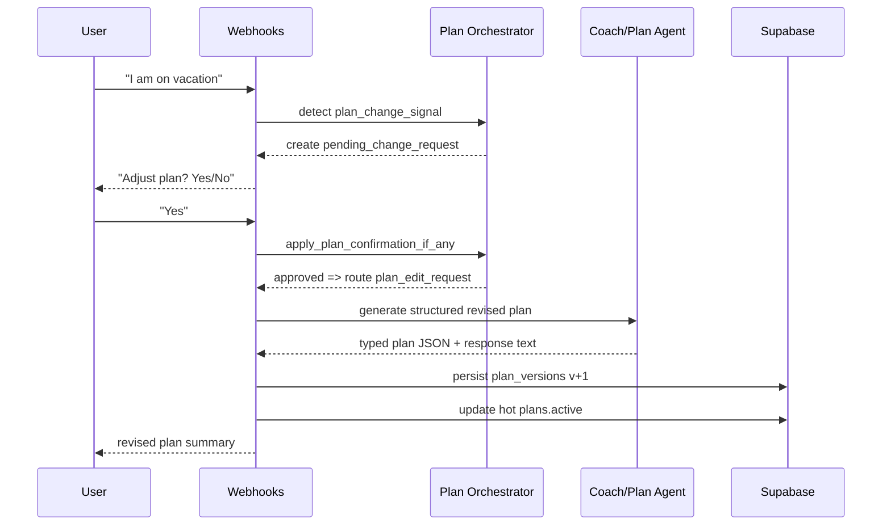
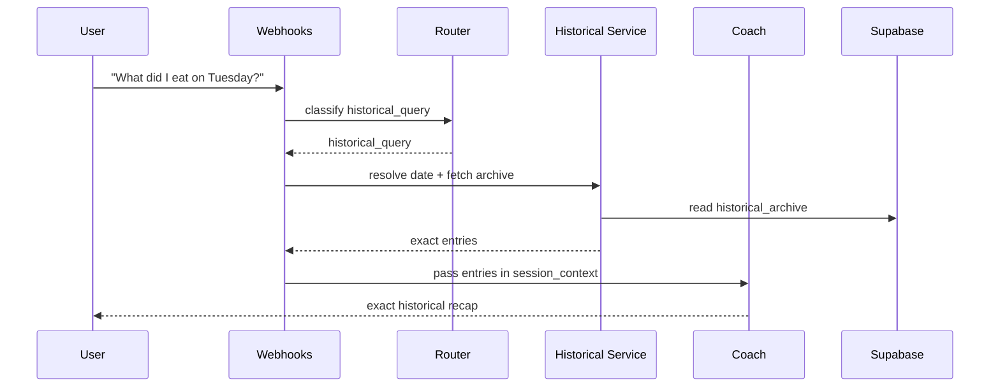

# Sequence Diagrams

## 1) Inbound Multi-Message Batch To Reply

```mermaid
sequenceDiagram
    participant U as User (WhatsApp)
    participant T as Twilio Webhook
    participant W as Webhooks Route
    participant Q as Per-Phone Queue
    participant A as Agents Pipeline
    participant DB as Supabase
    participant M as Twilio Outbound

    U->>T: text/image/audio burst
    T->>W: POST /webhook (multiple events)
    W->>DB: idempotency insert (MessageSid)
    W->>W: enqueue into 8s batch window
    W-->>U: immediate ACK TwiML
    W->>Q: flush batch after window
    Q->>A: process FIFO with lock
    A->>DB: load profile
    A->>A: router + memory + bio-math + psychology + coach + critic
    A->>DB: save updated profile
    A->>M: final response send
    M-->>U: WhatsApp message
```

## 2) Plan Change Signal With Confirmation

```mermaid
sequenceDiagram
    participant U as User
    participant W as Webhooks
    participant P as Plan Orchestrator
    participant C as Coach/Plan Agent
    participant DB as Supabase

    U->>W: "I am on vacation"
    W->>P: detect plan_change_signal
    P-->>W: create pending_change_request
    W-->>U: "Adjust plan? Yes/No"

    U->>W: "Yes"
    W->>P: apply_plan_confirmation_if_any
    P-->>W: approved => route plan_edit_request
    W->>C: generate structured revised plan
    C-->>W: typed plan JSON + response text
    W->>DB: persist plan_versions v+1
    W->>DB: update hot plans.active
    W-->>U: revised plan summary
```

## 3) Historical Query Fetch

```mermaid
sequenceDiagram
    participant U as User
    participant W as Webhooks
    participant R as Router
    participant H as Historical Service
    participant C as Coach
    participant DB as Supabase

    U->>W: "What did I eat on Tuesday?"
    W->>R: classify historical_query
    R-->>W: historical_query
    W->>H: resolve date + fetch archive
    H->>DB: read historical_archive
    H-->>W: exact entries
    W->>C: pass entries in session_context
    C-->>U: exact historical recap
```

